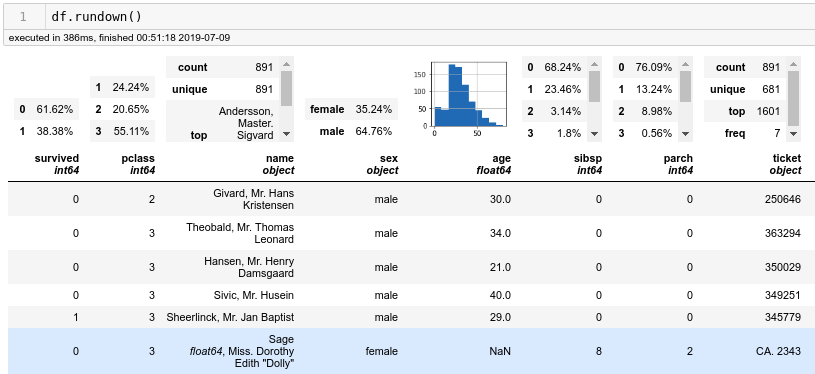

# rundown
A fun addition to pandas?

## Installation

We'll get to this, just do the `git clone` and the `pip install .` , you know.

## Usage

To be run in a Jupyter Notebook, or somewhere else with nice HTML rendering of Pandas tables (i.e. not Github)

```python
import pandas as pd
import rundown

pd.DataFrame.rundown = rundown.rundown_method

sample_df = # make one!

sample_df.rundown()
```

